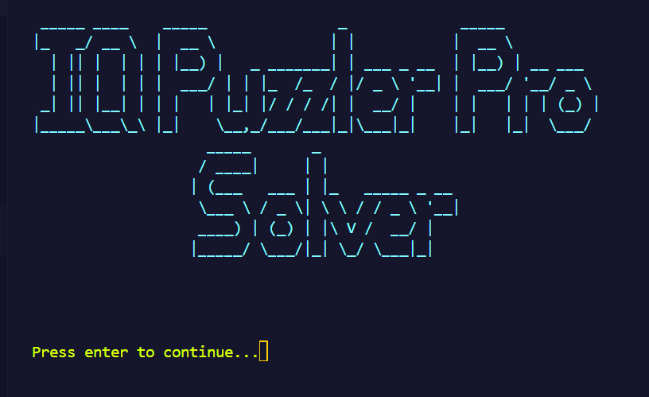
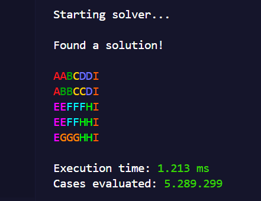

  
</br>

<H3 align="center"> Algoritma Brute Force : Tugas Kecil 1 IF2211 Strategi Algoritma </p>

</br>
</br>

##  Contributors

<div align="center">

<table border="1" cellspacing="0" cellpadding="8"> 
  <tr> <th>NIM</th> <th>Nama</th> </tr> 
  <tr> <td>13523035</td> <td>M. Rayhan Farrukh</td> </tr> 
  </tr> </table>
</div>

  

##  About

<h3 align="center"> IQ Puzzle Pro Solver  </h3>
<p align="center"><em>Puzzle solver using bruteforce algorithm</em></p>

<div align="center">
  
  
</div>
</br>
</br>
This program is a solver for the puzzle game IQ Puzzler Pro, using Recursive Backtrack Bruteforce Algorithm, written on Java. 
</br>
</br>
The user can input a puzzle configuration using a text file and the solution, if found, can be saved into a text or image file.

</br>

<div align="center">
  
  
</div>

 <h3>Features</h3>

 - Input configurations using ```.txt``` file
 - Save the solution to a text or image file
 - Default rectangle and Custom board configurations

##  Requirements

- OpenJDK Runtime Environment Corretto-17.0.12.7.1 (build 17.0.12+7-LTS)


##  How to use
<h3>Installation</h3>
Clone the repository

```sh
    git clone git@github.com:grwna/Tucil1-13523035.git
```
<p align="center">or</p>

```sh
   git clone https://github.com/grwna/Algeo02-23035.git
```
 then, navigate to the repository folder
 
 <h3>Windows</h3>

Compile with```.\compile``` then run with ```.\run```
 <h3>Linux</h3>

Give execute permission to the ```.sh``` files, then
compile with```./compile.sh``` and run with ```./run.sh```


 <h3>Usage</h3>

To use the program, make sure you have the text file for the puzzle configurations inside the ```IO/input/``` folder.

All output files are saved in ```IO/results/```.

If you wish, you may delete all files currently inside the ```IO/input/``` and ```IO/results``` folders.

##  File Structure

- ```bin``` contains compiled bytecodes of the program
- ```doc``` contains all kinds of documentation for the project
- ```IO```  stores the input and output of the program
- ```src``` contains source code of the program
- ```test``` holds the outcome of the program for test cases

